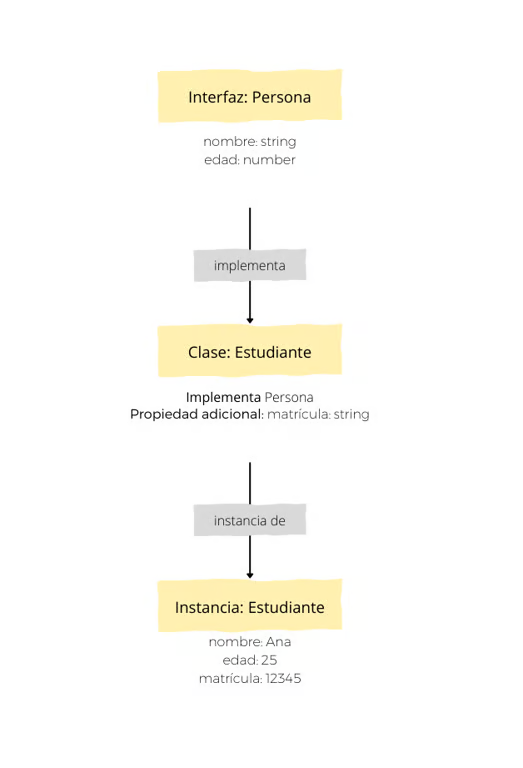

# Fundamentos de TypeScript
TypeScript es un lenguaje de programación de código abierto desarrollado por Microsoft. Se describe como un "superset" de JavaScript, lo que significa que cualquier código JavaScript válido también es código TypeScript. Este lenguaje agrega características adicionales como el tipado estático, interfaces y la programación orientada a objetos (POO), haciéndolo especialmente útil para proyectos grandes y complejos.

## Ventajas de TypeScript en proyectos Angular
- **Detección temprana de errores** 
    - El tipado estático permite encontrar errores en tiempo de desarrollo, evitando posibles fallos en producción.
    - Ejemplo: Asignar un número a una variable que debería ser un string generará un error antes de ejecutar el programa.
- Autocompletado y herramientas mejoradas
    - Los editores modernos, como Visual Studio Code, aprovechan las características de TypeScript para ofrecer autocompletado, refactorización segura y navegación fácil por el código.
- Escalabilidad
    - TypeScript es ideal para proyectos grandes donde se requiere un código mantenible y estructurado.
- Compatibilidad con JavaScript
    - TypeScript se transcompila a JavaScript, asegurando que pueda ejecutarse en cualquier entorno compatible con JavaScript.

## Tipos en TypeScript
Los tipos son fundamentales en TypeScript y ayudan a garantizar que el código sea consistente y claro. Los principales tipos son:
- **string**: Cadenas de texto. `let saludo: string = "Hola, TypeScript";`
- **number**: Números enteros o decimales. `let numero: number = 42;`
- **boolean**: Valores verdadero o falso. `let activo: boolean = true;`
- **any**: Permite cualquier tipo de dato, útil en situaciones donde el tipo no se conoce de antemano. `let desconocido: any = "Texto o número";`
- **void**: Usado en funciones que no retornan un valor.
```
function saludar(): void {
    console.log("Hola");
}
```
- **unknown**: Similar a any, pero requiere una verificación de tipo antes de usar el valor.
```
let dato: unknown = "Texto";
if (typeof dato === "string") {
    console.log(dato.toUpperCase());
}
```

## Interfaces en TypeScript
Las interfaces definen la estructura que deben seguir los objetos. Son útiles para validar que un objeto tenga propiedades específicas.
```typescript
interface Persona {
    nombre: string;
    edad: number;
}

let usuario: Persona = { nombre: "Juan", edad: 25 };
```
En este ejemplo, el objeto **usuario** debe tener las propiedades nombre y edad, ambas con el tipo de dato especificado en la interface **Persona**.

## Clases en TypeScript
Las clases permiten usar programación orientada a objetos (POO). Soportan conceptos como herencia, encapsulación y polimorfismo.
```typescript
class Vehiculo {
    constructor(public marca: string, public modelo: string) {}
}

class Coche extends Vehiculo {
    constructor(marca: string, modelo: string, public puertas: number) {
        super(marca, modelo);
    }
}

let miCoche = new Coche("Toyota", "Corolla", 4);
```
En este ejemplo:
- **Vehiculo** es la clase base con propiedades marca y modelo.
- **Coche** extiende la clase Vehiculo e incorpora una nueva propiedad puertas.
- **super()** se usa para llamar al constructor de la clase base.

## Transcompilación a JavaScript
TypeScript necesita ser transcompilado a JavaScript para ejecutarse en navegadores o entornos como Node.js. Esto se realiza mediante el compilador de TypeScript (tsc).
- Instalar el compilador de TypeScript: `npm install -g typescript`
- Compilar un archivo TypeScript a JavaScript: `tsc archivo.ts`

Este comando generará un archivo `archivo.js` listo para ejecutarse en cualquier entorno que soporte JavaScript.



## Tipos y Estructuras de Datos
TypeScript amplía los tipos básicos de JavaScript con características avanzadas, proporcionando mayor control sobre los datos.

### Tipos Avanzados
- **Tuplas**: Permiten definir un arreglo con un número fijo de elementos, cada uno con un tipo específico.
```typescript
let coordenadas: [number, number] = [10, 20];
```

- **Enums**: Representan un conjunto de valores constantes. Los valores pueden ser numéricos o de texto.
```typescript
enum Color {
    Rojo = "Rojo",
    Verde = "Verde",
    Azul = "Azul"
}

let colorFavorito: Color = Color.Rojo;
```

- **Union Types**: Permiten que una variable acepte múltiples tipos.
```typescript
let id: string | number;
id = 123;
id = "ABC123";
```

- **Tipo Literal**: Define valores específicos para una variable.
```typescript
let direccion: "Norte" | "Sur" | "Este" | "Oeste";
direccion = "Norte";
```

### Tipos Inferidos
TypeScript puede inferir automáticamente el tipo de una variable en función del valor asignado.

```typescript
let nombre = "Carlos"; // TypeScript infiere que es de tipo string.
```
En este caso, TypeScript infiere que nombre es de tipo string sin necesidad de declararlo explícitamente.


## Introducción a Node.js y npm
Node.js es una tecnología de servidor que permite ejecutar JavaScript en el lado del servidor. A pesar de ser una tecnología principalmente de back-end, su importancia en el desarrollo de aplicaciones Angular radica en la necesidad de contar con herramientas clave que se instalan a través de Node.js.

- **Puntos clave**:
    - **Ejecución de JavaScript en el servidor**: Permite la ejecución de código JavaScript fuera del navegador.
    - **Entorno de desarrollo**: Node.js se utiliza para instalar y gestionar paquetes esenciales para trabajar con Angular. ¿Por qué Node.js es esencial para Angular? Si bien Angular no se ejecuta en Node.js, su ecosistema de desarrollo depende en gran medida de este entorno para la instalación de dependencias y la ejecución de comandos del Angular CLI.
- **Razones clave**:
    - **Instalación de Angular CLI**: La herramienta Angular CLI se instala con npm, que proviene de Node.js.
    - **Gestión de dependencias**: A través de npm, se instalan bibliotecas y paquetes necesarios para el desarrollo de una aplicación Angular.
    - **Entorno de desarrollo**: Angular CLI usa comandos de Node.js y npm para compilar, ejecutar pruebas y preparar la aplicación para producción.
**Nota**: Aunque Node.js se usa durante el desarrollo, las aplicaciones Angular no requieren Node.js para ejecutarse en producción.

## Flujo de trabajo con Node.js en un proyecto Angular
El flujo de trabajo con Node.js en un proyecto Angular incluye varios pasos clave:
- Instalación de Node.js
    - Se instala Node.js desde nodejs.org.
    - Con la instalación de Node.js, se obtiene el acceso al administrador de paquetes npm (Node Package Manager).
- Creación de un proyecto Angular
    - Con Angular CLI instalado (gracias a npm), se crea un proyecto Angular con el comando: `ng new nombre-del-proyecto`
- Gestión de dependencias
    - La creación del proyecto genera un archivo package.json, que contiene todas las dependencias necesarias para el proyecto.
    - Las dependencias se instalan ejecutando: `npm install`
- Ejecución del servidor de desarrollo
    - Angular se ejecuta en un servidor de desarrollo local mediante: `ng serve`
- Compilación para producción
    - La aplicación se compila para producción con: `ng build --prod`
- Archivos esenciales de Node.js en un proyecto Angular
    - package.json
        - Este archivo actúa como "manifiesto" del proyecto. Contiene información clave, como: Nombre y versión del proyecto Dependencias: Listado de bibliotecas necesarias para que la aplicación funcione. Scripts de comandos: Comandos predefinidos para ejecutar tareas comunes, como pruebas, compilaciones y ejecución. 
            - Comandos clave de npm: `npm init # Inicializa un nuevo package.json` o `npm init --yes   # Crea un package.json con valores predeterminados`
        - Ejemplo de package.json:
        ```bash
        {
            "name": "mi-proyecto-angular",
            "version": "1.0.0",
            "scripts": {
                "start": "ng serve",
                "build": "ng build"
            },
            "dependencies": {
                "@angular/core": "^15.0.0",
                "rxjs": "^7.0.0"
            },
            "devDependencies": {
                "@angular/cli": "^15.0.0",
                "typescript": "^4.0.0"
            }
        }
        ```

## Comandos esenciales de Node.js para Angular

| Comando         | Descripción                                             |
|-----------------|---------------------------------------------------------|
| `npm init`      | Crea un archivo `package.json` inicial.                |
| `npm install`   | Instala las dependencias de un proyecto.               |
| `npm start`     | Ejecuta el script de inicio definido en `package.json`.|
| `npm run build` | Ejecuta el script de compilación definido en `package.json`. |
| `ng new`        | Crea un nuevo proyecto Angular.                        |
| `ng serve`      | Sirve la aplicación en el servidor de desarrollo.      |
| `ng build`      | Compila la aplicación para producción.                 |

## Decoradores en TypeScript
Los decoradores son funciones especiales que se utilizan para modificar clases, métodos, propiedades o parámetros. Angular utiliza decoradores para definir componentes, directivas y servicios.

### Tipos de Decoradores
- **Decorador de Clase**
```typescript
function Log(clase: Function) {
  console.log(`La clase ${clase.name} ha sido declarada.`);
}

@Log
class MiClase {}
```
Explicación: El decorador @Log imprime un mensaje cuando la clase MiClase es creada.

- **Decorador de Propiedad**
```typescript
function Capitalizar(target: any, key: string) {
  let valor = target[key];

  const getter = () => valor.toUpperCase();
  const setter = (nuevoValor: string) => valor = nuevoValor;

  Object.defineProperty(target, key, { get: getter, set: setter });
}

class Usuario {
  @Capitalizar
  nombre: string = "juan";
}

const usuario = new Usuario();
console.log(usuario.nombre); // JUAN
```
Explicación: El decorador @Capitalizar transforma la propiedad nombre a mayúsculas.

- **Decorador de Método**
```typescript
function Autobind(_: any, _2: string, descriptor: PropertyDescriptor) {
  const metodoOriginal = descriptor.value;
  const nuevoDescriptor: PropertyDescriptor = {
    configurable: true,
    enumerable: false,
    get() {
      const boundFn = metodoOriginal.bind(this);
      return boundFn;
    }
  };
  return nuevoDescriptor;
}

class Boton {
  mensaje = "Haz clic en mí";

  @Autobind
  mostrarMensaje() {
    console.log(this.mensaje);
  }
}

const boton = new Boton();
const botonHTML = document.querySelector('button');
botonHTML?.addEventListener('click', boton.mostrarMensaje);
```
Explicación: El decorador @Autobind asegura que this en el método mostrarMensaje siempre se refiera a la clase Boton.