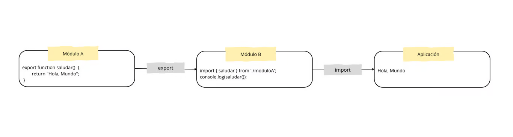

# Módulos y componentes

## Sistema de módulos
El sistema de módulos en Angular organiza el código en bloques reutilizables. Cada archivo en TypeScript puede actuar como un módulo, facilitando la organización, reutilización y mantenimiento del código.

### Exportación e importación
Para compartir funcionalidades entre diferentes partes de la aplicación, Angular permite exportar e importar elementos entre módulos.

#### Exportar elementos
Se utiliza la palabra clave export para hacer que una función, clase o variable esté disponible para otros módulos.
```typescript
export function saludar(nombre: string): string {
  return `Hola, ${nombre}`;
}
```

#### Importar elementos
Se utiliza la palabra clave import para incluir las funcionalidades exportadas desde otros módulos.
```typescript
import { saludar } from './utilidades';
console.log(saludar("Mundo"));
```

### Ventajas del Sistema de Módulos
- **Organización**: Facilita la separación de responsabilidades y la estructura del código.
- **Reutilización**: Permite utilizar el mismo módulo en diferentes partes del proyecto o en otros proyectos.
- **Mantenimiento**: El código modular es más fácil de depurar, probar y actualizar.



## Componentización en Angular
En Angular, las aplicaciones están organizadas en componentes. Cada componente encapsula lógica, vistas y estilos, lo que permite dividir la aplicación en partes independientes que se pueden reutilizar y mantener de forma sencilla.

Partes de un Componente Un componente de Angular se compone de los siguientes archivos clave:
- **Archivo .ts (TypeScript)**: Este archivo contiene la lógica y los datos del componente. Define el comportamiento del componente y sus propiedades.
    - Ejemplo:
    ```typescript
    export class AppComponent {
        titulo: string = "Mi Aplicación Angular";
    }
    ```
- **Archivo.html (HTML)**
    - Este archivo define la vista del componente, es decir, la interfaz gráfica que el usuario puede ver e interactuar.
        - Ejemplo: `<h1>{{ titulo }}</h1>`, en este ejemplo, la sintaxis `{{ titulo }}` se utiliza para realizar data binding (enlace de datos) entre la lógica de la aplicación y la vista.

- **Archivo.css (CSS)**
    - Este archivo contiene los estilos específicos para el componente. Los estilos aplicados aquí afectan solo a la vista de este componente y no a otros componentes de la aplicación.
    - Ejemplo:
    ```bash
    h1 {
        color: blue;
        font-size: 24px;
    }
    ```