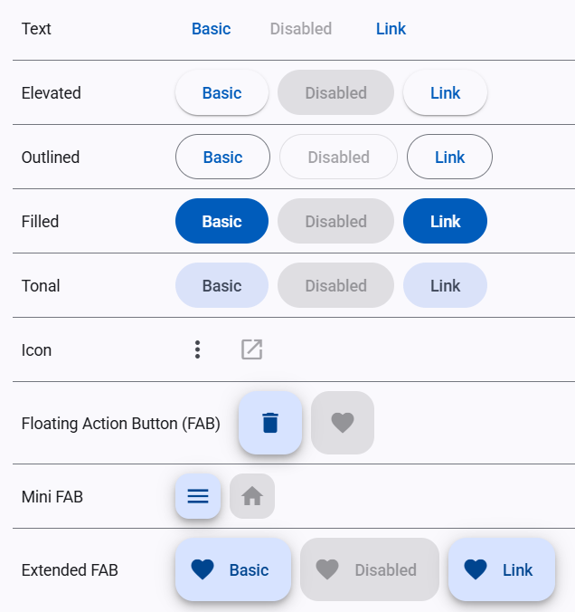
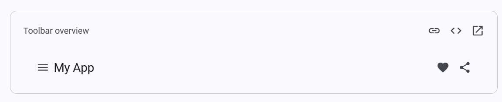
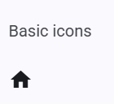
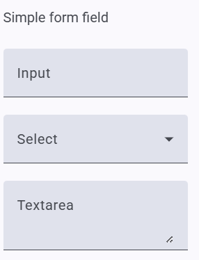
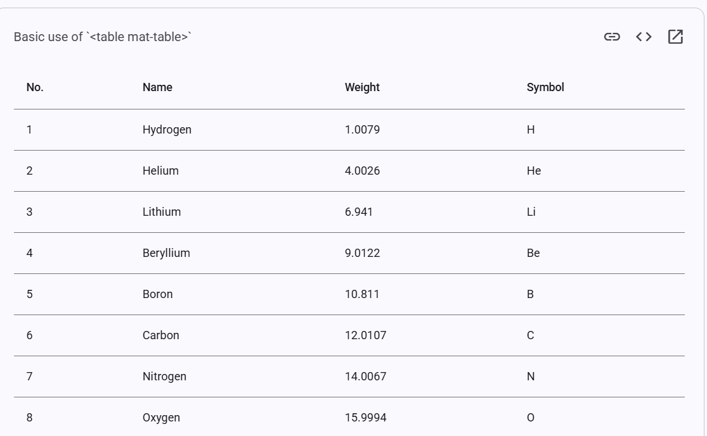

# Librerías visuales
Angular Material es una biblioteca de componentes para Angular basada en los principios de diseño de **Material Design**, un sistema desarrollado por Google que busca unificar diseño visual y usabilidad en aplicaciones web y móviles. Su propósito principal es proporcionar herramientas que permitan crear interfaces modernas, consistentes y accesibles de forma rápida y eficiente.

## ¿Por qué usar Angular Material?
- **Componentes preconstruidos**: Ofrece elementos como botones, tarjetas, cuadros de diálogo, menús, barras de navegación, entre otros.
- **Consistencia visual**: Garantiza una interfaz de usuario uniforme y profesional, siguiendo las pautas de Material Design.
- **Accesibilidad integrada**: Los componentes están optimizados para cumplir con buenas prácticas de accesibilidad.
- **Compatibilidad multiplataforma**: Las aplicaciones funcionan correctamente en dispositivos móviles y de escritorio.
- **Optimización del tiempo de desarrollo**: Facilita el diseño y reduce la necesidad de crear componentes desde cero.

**Ejemplo** 
Un botón en Angular Material puede incluir funcionalidades como efectos de sombreado o resaltado al interactuar con el usuario:
```html
<button mat-raised-button color="primary">Click aquí</button>
```
Angular Material es una elección ideal para desarrolladores que buscan una solución ágil para el diseño de aplicaciones modernas.

## Instalación de Angular Material
- A través del siguiente comando: `ng add @angular/material`

## Ejemplos de Componentes
Angular Material incluye numerosos componentes que pueden implementarse fácilmente en cualquier proyecto Angular. A continuación, se explican tres ejemplos populares:

### Botones
Los botones permiten a los usuarios interactuar con la aplicación a través de acciones como enviar formularios o navegar.
- **Tipos de botones**:
    - Básico
    - Raised (elevado)
    - Stroked (contorno)
    - Flat (plano)

- **Características principales**:
    - Personalización de estilos (elevados, planos, íconos).
    - Efectos visuales como sombras o cambios de color al pasar el cursor.

**Ejemplo** de botón básico:
```html
<button mat-raised-button color="accent">Guardar</button>
```



### Barras de Herramientas
Las barras de herramientas agrupan elementos como menús, títulos o botones.

**Ejemplo** de barra de herramientas básica:
```html
<mat-toolbar color="primary">
<span>Mi Aplicación</span>
<button mat-button>Inicio</button>
</mat-toolbar>
```



### Cuadrículas (Grid)

El sistema de cuadrículas organiza el contenido en un diseño de columnas y filas.

**Ejemplo** de cuadrícula básica:
```html
<mat-grid-list cols="2" rowHeight="100px">
<mat-grid-tile>Item 1</mat-grid-tile>
<mat-grid-tile>Item 2</mat-grid-tile>
</mat-grid-list>
```


### Cards (Tarjetas)
Las Material Cards permiten mostrar información con una estructura de cabecera, cuerpo y pie.


Importación: `import { MatCardModule } from '@angular/material/card';`


**Ejemplo** de uso:
```html
<mat-card>
    <mat-card-header>
        <mat-card-title>Título de la Tarjeta</mat-card-title>
        <mat-card-subtitle>Subtítulo</mat-card-subtitle>
    </mat-card-header>

    <mat-card-content>
        <p>Este es el contenido principal de la tarjeta.</p>
    </mat-card-content>

    <mat-card-actions>
        <button mat-button>Acción 1</button>
        <button mat-button>Acción 2</button>
    </mat-card-actions>
</mat-card>
```

### Íconos
Permiten usar íconos SVG o personalizados en la aplicación.

Importación: `import { MatIconModule } from '@angular/material/icon';`




Uso en la vista:
```html
<mat-icon>home</mat-icon>
```

### Formularios

Facilitan la creación de formularios con campos de entrada de texto, listas desplegables, áreas de texto, entre otros.

Importación:
```typescript
import { MatFormFieldModule } from '@angular/material/form-field';
import { MatInputModule } from '@angular/material/input';
import { MatSelectModule } from '@angular/material/select';
```

Uso en la vista:
```html
<mat-form-field>
    <mat-label>Nombre</mat-label>
    <input matInput placeholder="Escribe tu nombre">
</mat-form-field>
```



### Diálogos
Los cuadros de diálogo permiten mostrar mensajes emergentes o formularios.

Uso en la vista:
```html
<button mat-button (click)="abrirDialogo()">
    Abrir diálogo
</button>
```

Componente de diálogo:

```typescript
import { MatDialog } from '@angular/material/dialog';

export class ComponentePadre {
  constructor(public dialog: MatDialog) {}

  abrirDialogo(): void {
    this.dialog.open(DialogEjemploComponent);
  }
}
```

### Tablas
Permiten mostrar listas de datos con soporte para paginación, ordenamiento y filtrado.

Importación: `import { MatTableModule } from '@angular/material/table';`


Uso en la vista:

```html
<table mat-table [dataSource]="dataSource">
  <!-- Definición de columnas -->
  <ng-container matColumnDef="nombre">
    <th mat-header-cell *matHeaderCellDef> Nombre </th>
    <td mat-cell *matCellDef="let element"> {{element.nombre}} </td>
  </ng-container>

  <!-- Fila -->
  <tr mat-header-row *matHeaderRowDef="displayedColumns"></tr>
  <tr mat-row *matRowDef="let row; columns: displayedColumns;"></tr>
</table>
```

## Configuración de temas y personalización de estilos
Permite personalizar la apariencia de la aplicación mediante la configuración de temas.

**Acción**: Configurar el archivo `theme.scs`s para definir la paleta de colores.

Ejemplo:
```css
@import '~@angular/material/theming';
$mi-paleta: (
  primary: #2196F3,
  accent: #FFC107,
  warn: #F44336
);
```

## Configuración de breakpoints (Responsive Design)
Permite adaptar la visualización de la aplicación a diferentes tamaños de pantalla.

**Acción**: Usar `mat-grid-list` para crear una cuadrícula responsiva.

Ejemplo de uso:
```html
<mat-grid-list cols="2" rowHeight="100px">
  <mat-grid-tile>1</mat-grid-tile>
  <mat-grid-tile>2</mat-grid-tile>
</mat-grid-list>
```