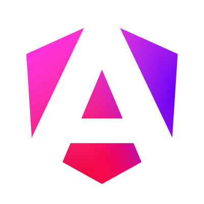

#  Angular 

## 🖥️​ Temario
- Introducción a Angular
- Fundamentos de Angular
- Comunicación entre componentes
- Angular avanzado
- Programación reactiva con RxJS
- Organización y nvaegación con Angular
- Estrategias avanzadas
- Testing y gestión de estado
- Gestión avanzada con NgRx
- IA aplicada a Angular

## ✍️​ Material complementario
- **Angular doc-Documentacion Oficial**
    - https://v17.angular.io/docs
- **Angular-CLI-Documentacion Oficial**
    - https://v17.angular.io/cli
- **Programación con angular**
    - https://soka.gitlab.io/angular/conceptos/componentes/comunicacion-entre-componentes/comunicacion-entre-componentes/

## 👩‍💻 Créditos
By **Cecilia Perdomo**
- https://www.linkedin.com/in/cecilia-perdomo/ 